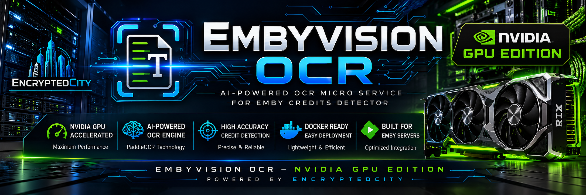

<p align="center">
  
</p>

<p align="center">


</p>

# EmbyVision OCR (GPU Edition)

AI-powered **NVIDIA GPU-accelerated OCR microservice** built specifically for the **Emby Credits Detector** plugin using **PaddleOCR**, **CUDA**, **cuDNN**, and **Docker**.

EmbyVision OCR is a lightweight REST API that performs high-speed Optical Character Recognition (OCR) on video frames to significantly improve movie and television credit detection inside Emby.

Unlike traditional OCR solutions, EmbyVision OCR leverages PaddleOCR's deep-learning models running entirely on your NVIDIA GPU, providing dramatically faster inference and higher recognition accuracy.

The **GPU Edition** is intended for users who want maximum performance on modern NVIDIA graphics cards.

---

# Why EmbyVision OCR?

Traditional OCR engines can struggle with:

- Fast-moving credits
- Stylized fonts
- Low contrast text
- Dark backgrounds
- Small text
- Motion blur

EmbyVision OCR uses AI-based deep learning models trained specifically for text recognition, allowing the Emby Credits Detector plugin to achieve far better detection accuracy while reducing scan times.

---

# Features

- NVIDIA GPU accelerated OCR
- CUDA + cuDNN inference
- PaddleOCR deep-learning engine
- Extremely fast OCR processing
- Designed specifically for Emby Credits Detector
- REST API
- Docker deployment
- Persistent PaddleOCR model storage
- Automatic AI model downloads
- No database required
- Lightweight container
- Self-hosted
- Privacy focused
- Supports Unraid
- Supports Docker Compose
- Supports Linux

---

# Performance

Compared to CPU OCR, the GPU Edition offers:

- Significantly faster library scans
- Reduced CPU usage
- Better OCR accuracy
- Faster batch processing
- Better performance on large media libraries

Performance depends on:

- GPU model
- CUDA version
- Driver version
- Storage speed

---

# Requirements

## Supported Hardware

✔ NVIDIA GTX Series

✔ NVIDIA RTX Series

✔ NVIDIA Tesla

✔ NVIDIA Quadro

✔ NVIDIA Data Center GPUs

---

## Unsupported Hardware

This edition **does not support:**

- AMD GPUs
- Intel Arc
- Intel Quick Sync
- CPU-only systems

If you do not own an NVIDIA GPU, please use the CPU Edition:

https://github.com/encryptedcity/embyvision-ocr

---

# Requirements

You must have:

- Docker
- NVIDIA Driver
- NVIDIA Container Toolkit
- CUDA compatible NVIDIA GPU
- Emby Server
- Emby Credits Detector Plugin

---

# Docker Image

```
ghcr.io/encryptedcity/embyvision-ocr-gpu:latest
```

---

# Docker Compose

```yaml
services:

  embyvision-ocr-gpu:

    image: ghcr.io/encryptedcity/embyvision-ocr-gpu:latest

    container_name: embyvision-ocr-gpu

    restart: unless-stopped

    runtime: nvidia

    ports:
      - "8001:8001"

    volumes:
      - /mnt/user/appdata/embyvision-ocr-gpu/models:/root/.paddleocr

    environment:
      - NVIDIA_VISIBLE_DEVICES=GPU-dedbc798-12fc-ca4b-d11b-1262637f3c64
      - NVIDIA_DRIVER_CAPABILITIES=compute,utility
      - CUDA_VISIBLE_DEVICES=0
      - TZ=America/Edmonton
```

Replace the GPU UUID, GPU index, and timezone with values appropriate for your system.

---

# Unraid Installation

EmbyVision OCR has been tested on Unraid and works exceptionally well with the NVIDIA Driver plugin.

---

## Step 1

Install:

- Community Applications
- NVIDIA Driver Plugin

Reboot after installing the NVIDIA Driver plugin.

---

## Step 2

Verify Docker can see your GPU.

Open the Unraid terminal:

```bash
nvidia-smi
```

You should see your GPU information.

---

## Step 3

Install the Container

Repository

```
ghcr.io/encryptedcity/embyvision-ocr-gpu:latest
```

Container Name

```
embyvision-ocr-gpu
```

Network Type

```
Bridge
```

Restart Policy

```
Unless Stopped
```

---

## Port Mapping

| Host | Container |
|-------|-----------|
| 8001 | 8001 |

---

## Volume Mapping

Host

```
/mnt/user/appdata/embyvision-ocr-gpu/models
```

Container

```
/root/.paddleocr
```

This allows PaddleOCR models to persist between updates and container recreations.

---

## Environment Variables

### NVIDIA_VISIBLE_DEVICES

Use either:

```
all
```

or your GPU UUID:

```
GPU-dedbc798-12fc-ca4b-d11b-1262637f3c64
```

---

### CUDA_VISIBLE_DEVICES

```
0
```

Selects which GPU PaddleOCR should use.

---

### NVIDIA_DRIVER_CAPABILITIES

```
compute,utility
```

---

### TZ

Example

```
America/Edmonton
```

Use your local timezone.

---

## Extra Parameters

```
--runtime=nvidia
```

---

## Start the Container

The first startup downloads PaddleOCR AI models.

This is expected.

Depending on your internet speed, the first launch may take several minutes.

Future restarts are almost instantaneous.

---

# Connecting Emby

Inside the Emby Credits Detector plugin:

OCR Server

```
http://YOUR_SERVER_IP:8001
```

Example

```
http://192.168.1.218:8001
```

Click **Test Connection**.

If successful, Emby will begin using EmbyVision OCR automatically.

---

# API

## Health Check

```
GET /
```

Example

```json
{
  "status":"OCR running"
}
```

---

## OCR Endpoint

```
POST /ocr/file
```

Multipart form upload.

Returns OCR text extracted from the supplied image.

---

# Updating

Updating is simple.

```bash
docker compose pull

docker compose up -d
```

or in Unraid:

- Check for Updates
- Apply Update

Your PaddleOCR models remain intact because they are stored outside the container.

---

# Troubleshooting

## Models Download Every Startup

Verify:

```
/root/.paddleocr
```

is mapped to persistent storage.

---

## GPU Not Being Used

Run:

```bash
nvidia-smi
```

You should see a Paddle process while OCR requests are running.

Also verify:

```
runtime: nvidia
```

and

```
NVIDIA_VISIBLE_DEVICES
```

---

## Container Immediately Stops

Verify:

- NVIDIA Driver installed
- NVIDIA Container Toolkit installed
- Docker NVIDIA runtime enabled
- Compatible NVIDIA GPU

---

## Emby Cannot Connect

Verify:

- Container running
- Port 8001 exposed
- Correct server IP
- Firewall rules
- Reverse proxy (if applicable)

---

## Slow First Startup

Normal.

The container downloads PaddleOCR AI models during first launch.

These downloads occur only once.

---

# Privacy

Everything runs entirely on your own server.

- No cloud OCR
- No telemetry
- No analytics
- No external API calls
- No account required
- Your media never leaves your network

---

# Roadmap

Planned improvements include:

- Multiple language OCR support
- Multiple GPU selection
- Health monitoring endpoint
- Batch OCR optimizations
- Improved logging
- Optional OCR confidence reporting
- Native Unraid Community Applications template
- ARM64 support (when PaddleOCR GPU support becomes available)

---

# Credits

Developed by **EncryptedCity**

Powered by:

- PaddleOCR
- PaddlePaddle
- NVIDIA CUDA
- cuDNN
- FastAPI
- Docker
- Emby

---

# License

This project is released under the MIT License.

Please review the licenses of PaddleOCR, PaddlePaddle, NVIDIA CUDA, and other third-party software used by this project.

---

## ⭐ Support the Project

If EmbyVision OCR improves your Emby experience, consider giving the repository a **Star** on GitHub.

It helps others discover the project and supports future development.

---

**EncryptedCity**

*Software • Innovation • Privacy*
